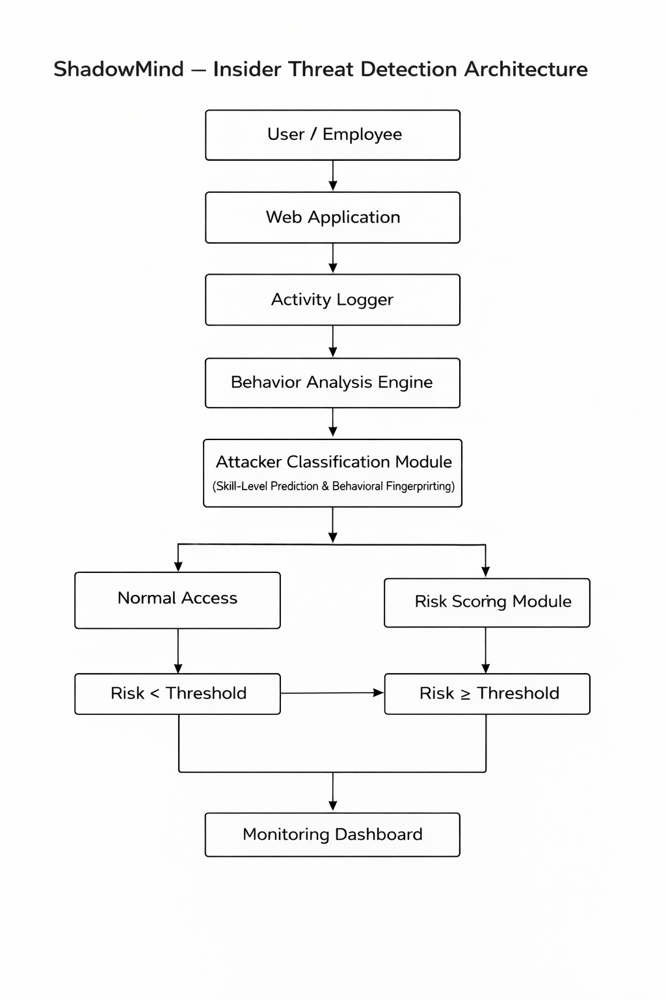

# ShadowMind – Adaptive Insider Threat Detection System

## 🧩 Problem Statement

Traditional cybersecurity systems detect perimeter threats but fail to identify abnormal behavior from trusted internal users.  
Insider threats often bypass firewalls and static defenses, leading to severe data breaches.

---

## 🚀 Solution Overview

ShadowMind monitors internal user activity in real time and detects behavioral anomalies.  
Instead of simply blocking suspicious users, the system isolates them into a controlled deception environment and collects behavioral intelligence for further analysis.

---

## 🔍 Key Features

- Real-time activity monitoring  
- Baseline vs anomaly detection  
- Attacker classification (skill-level & behavioral fingerprinting)  
- Risk scoring and decision making  
- Controlled containment via deception sandbox  
- Security monitoring dashboard  

---

## 🏗️ Architecture

The system consists of the following modules:

1. **User / Employee Client**  
2. **Web Application**  
3. **Activity Logger**  
4. **Behavior Analysis Engine**  
5. **Attacker Classification Module**  
   - Predicts skill level  
   - Fingerprints behavior patterns  
6. **Risk Scoring Module**  
   - Assigns risk value  
7. **Decision Branch**  
   - Normal Access (low risk)  
   - Deception Sandbox (high risk)  
8. **Monitoring Dashboard**

---

## 🖼 Architecture Diagram



---

## 🛠 Proposed Tech Stack

- Backend: **FastAPI (Python)**  
- Frontend: **React or simple HTML/CSS**  
- Database: **SQLite**  
- Visualization / Dashboard: **Chart.js / Streamlit**

---

## 📁 Repository Structure (Planned)
```
/backend
├─ app.py
├─ detectors.py
├─ classifier.py
/frontend
├─ index.html
├─ dashboard.js
/README.md
/architecture.png
```
---

## 🧠 Innovation Summary

ShadowMind doesn’t just detect threats — it **engages and contains** suspicious users intelligently.  
By profiling attacker behavior and skill level, ShadowMind adapts its responses, provides deception, and gathers intelligence — a step beyond traditional detection.
